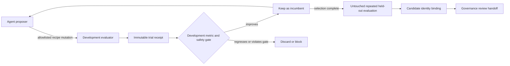

# Case Study: Governed Autoresearch-Style LoRA Recipe Optimizer

This case study demonstrates rapid, autonomous-style LoRA recipe exploration
inside Flight Recorder's evidence and governance boundaries. A proposer emits
one bounded hypothesis at a time, an evaluator scores the resulting recipe on
development evidence only, and Flight Recorder keeps or discards the candidate
while recording immutable trial receipts.

After candidate selection is complete, a separate gate evaluates the exact
selected candidate against frozen, rolling, and adversarial pools. The final
handoff binds the selected candidate identity to the evaluated adapter identity
before declaring the evidence ready for governance review.

This is a deterministic synthetic demonstration. It downloads no model, runs
no GPU training, calls no provider, updates no registry alias, and makes no
claim that the simulated recipe would improve a real model.

## Reproduce it

Use a fresh output directory:

```bash
python3 scripts/run_lora_recipe_autoresearch_demo.py \
  --out runs/autoresearch_lora_optimizer
```

Expected campaign behavior:

- one baseline plus five proposed mutations;
- at least one improving candidate retained;
- at least one regression discarded;
- zero held-out artifacts exposed during recipe selection;
- three repeated seeds across frozen, rolling, and adversarial promotion pools;
- replayable candidate-identity binding;
- promotion evidence ready for governance review, with promotion itself still
  unapplied.

Validate the public artifacts:

```bash
python3 -m flightrecorder schemas --check runs/autoresearch_lora_optimizer/search_plan.json
python3 -m flightrecorder schemas --check runs/autoresearch_lora_optimizer/search_result.json
python3 -m flightrecorder schemas --check runs/autoresearch_lora_optimizer/promotion_evidence.json
python3 -m flightrecorder schemas --check runs/autoresearch_lora_optimizer/promotion_handoff.json
python3 scripts/validate_lora_recipe_autoresearch_demo.py \
  --result runs/autoresearch_lora_optimizer/mission_result.json
```

The demo refuses a non-empty output directory so evidence from different
campaigns cannot be silently mixed.

## Trust boundary



The search plan freezes:

- the development suite fingerprint and its explicit `development` role;
- the base recipe;
- mutable recipe fields;
- the optimization direction and required improvement delta;
- critical-failure tolerance;
- campaign and per-trial cost, duration, and trial ceilings;
- a boundary that forbids held-out inputs, promotion, external side effects
  launched by the search process, and model-weight updates by Flight Recorder.

The proposer receives current development results, the incumbent recipe, the
allowlist, and remaining budget. It receives no held-out paths or results. An
invalid mutation is recorded as blocked and never reaches the evaluator.

The search result is not promotion evidence. It can only recommend running the
separate governed held-out evaluation. The promotion handoff becomes ready only
when:

1. the search plan and every trial replay successfully;
2. candidate selection reports zero held-out access;
3. the existing three-arm repeated promotion evidence replays and passes;
4. the selected candidate SHA-256 exactly matches the evaluated adapter
   SHA-256.

Even a passing handoff does not move a registry alias or deploy a model.

## Artifacts

| Artifact | Contract | Purpose |
| --- | --- | --- |
| `search_plan.json` | `hfr.lora_recipe_search_plan.v1` | Immutable search space, evidence, policy, and budgets. |
| `trial-*.json` | `hfr.lora_recipe_trial.v1` | Proposal, parent, recipe, metric, resource usage, and keep/discard/block decision. |
| `search_result.json` | `hfr.lora_recipe_search_result.v1` | Replayed campaign ledger and development-selected champion. |
| `promotion_evidence.json` | `hfr.agentic_eval_promotion_evidence.v1` | Existing repeated three-arm held-out comparison and non-regression gates. |
| `promotion_handoff.json` | `hfr.lora_recipe_promotion_handoff.v1` | Candidate identity binding and governance-review readiness. |
| `REPORT.md` | Human-readable | Compact campaign and promotion-boundary report. |

## Replace the synthetic adapters

[`flightrecorder/lora_recipe_search.py`](../../../flightrecorder/lora_recipe_search.py)
defines narrow `RecipeProposer` and `RecipeEvaluator` protocols. A real setup
can replace the queue proposer with a coding agent driven by [`program.md`](program.md).
Training should be launched through a separately reviewed external/controller
plan; its completed, content-addressed development result can then be imported
through the evaluator protocol.

The imported evaluator result must return normalized development metrics,
critical-failure count, actual cost and duration, execution/side-effect posture,
and an immutable candidate identity. The search process does not receive final
held-out inputs or launch the external job. Real training, provider calls,
model downloads, and serving remain explicit external actions subject to the
repository's approval, containment, recovery, and credential rules.
